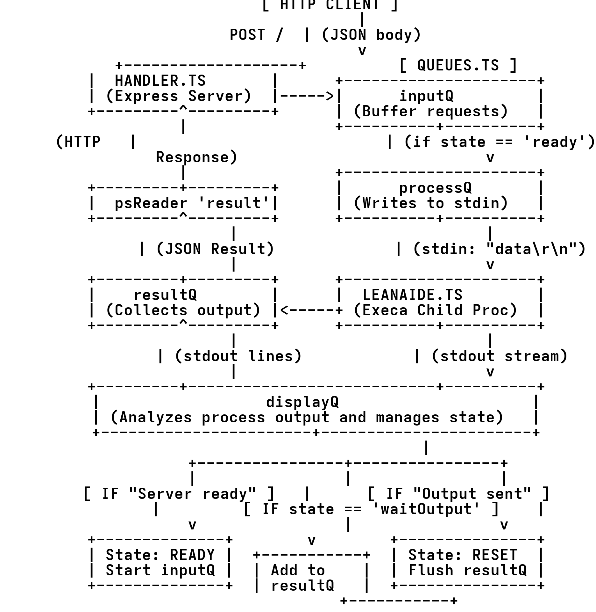

# Leanaide Server

    LINUX

<h2>Pre-Requisites</h2>

<ol>
<li> Install Mise 
    <code>curl https://mise.run | sh</code>
</li>
<li> 
Use mise to add the following things 
    <ol>
        <li> Bun 
            <code>mise use bun</code> 
        </li>
        <li> Node 
            <code>mise use node</code> 
        </li>
    </ol>
</li>

<li>
Run <code>bun init</code> 
from the server directory.  
Wait for the packages to install.
</li>

<h2>Running the servers</h2>
<ol>

Run <code>bun run index</code> to run   
the leanaide server.

<li>
To run the client server (ideally on a diff machine) <code> bun run-producer-server</code>. 
<em> 
Using <code>producer-server</code> because diagrams and code   
use that term. Whenever one comes across   the term "producer" - it implies client side. Whether it is code or diagram
</em>
</li>
</ol>

<h2>Testing the server</h2>

     
    
</img>

<ol>
<li>
<h3>Dummy client on the same machine</h3>
    Currently using the dummy client provided as producer client which one can run on the same machine :
    <code>bun run-dummy-client</code>
</li>
</ol>

    

        WINDOWS
    

    WIP

    

        Mac
    

    Similar to steps for linux but not tested so proceed with caution

